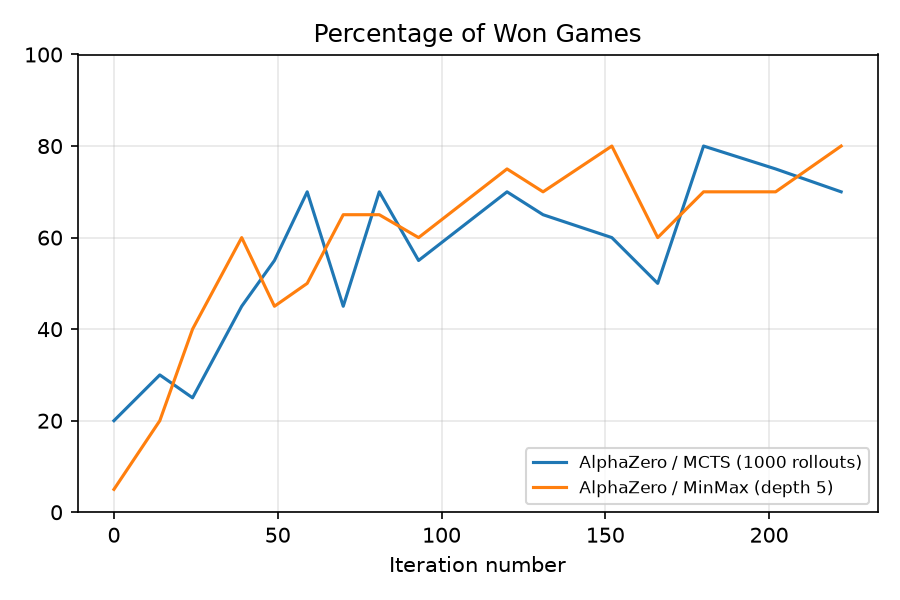
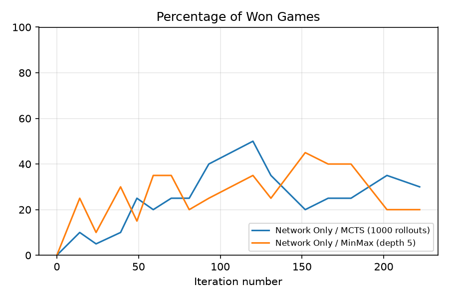
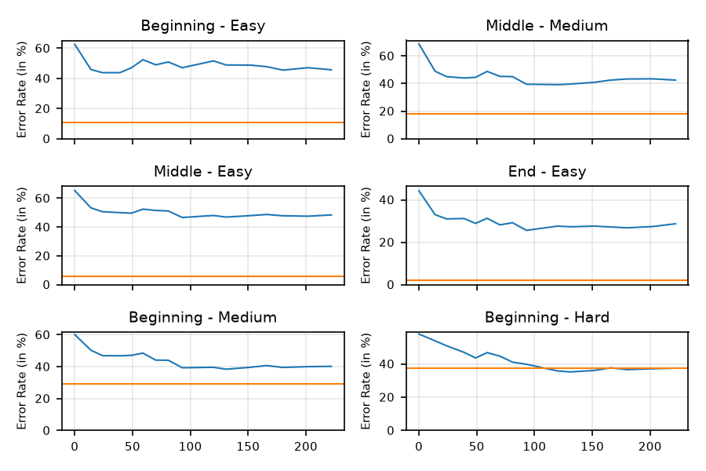

# alphazero-connect4

An AlphaZero-style Connect 4 bot I built from scratch to learn how game AI works.

I did it in four stages, each one building on the last:

1. **Game engine** - the board, dropping pieces, checking for wins
2. **Minimax + alpha-beta** with a hand-written scoring function
3. **Monte Carlo Tree Search** with random rollouts
4. **Neural network + self-play** (the AlphaZero part)

Stage 2 turned out to be really useful later on, because it gave me a decent
opponent to test the neural net against.

## Setup

```bash
pip install -r requirements.txt
```

You need Python 3.13. PyTorch will use your GPU if you have one, otherwise CPU
(training is much slower on CPU). tkinter comes with Python, so the window needs
nothing extra beyond Pillow, which is in requirements.txt.

## Play against it

There's a window:

```bash
python -m connect4.gui
python -m connect4.gui --opponent alphabeta --depth 6
python -m connect4.gui --checkpoint checkpoints/big/best.pt --simulations 800
```

Hover over a column to see where the piece would land, click to drop it. **New
game** asks which colour you want (red goes first). When someone wins, the four
pieces that did it get outlined.

The board is drawn with Pillow rather than tkinter shapes, because tkinter's
circles come out jagged - there's no anti-aliasing on its canvas. The pieces are
rendered once at startup and pasted, so hovering stays smooth.

The bot thinks on a background thread. If it didn't, the window would freeze for
the whole search and Windows would grey it out as not responding.

### Or in the terminal

```bash
python -m connect4.play --opponent alphabeta --depth 6
python -m connect4.play --checkpoint checkpoints/best.pt --simulations 400
```

You're red and go first. Type a column number 0-6. This one prints what the bot
was thinking each move - how many times it looked at each column, and whether it
thinks it's winning:

```
search: 0:  0% 1:  3% 2: 70% 3:  2% 4: 22% 5:  3% 6:  0%   value -0.24
```

Both take `--second` to let the bot move first and `--opponent random`.

## Train it

```bash
python run_overnight.py --hours 10 --tag myrun
python run_overnight.py --hours 10 --tag big --channels 128 --blocks 8 --simulations 800
```

It plays games against itself, trains on them, then plays the new network against
the old one and only keeps it if it actually wins. Checkpoints and a log go in
`checkpoints/myrun/`.

To stop it early without losing anything:

```bash
# create a file called STOP in the run's folder
touch checkpoints/myrun/STOP
```

It finishes the current round and saves before exiting.

## Results

All of this is from one network trained for about 16 hours, 222 iterations at 400
simulations a move.

### Games won against fixed opponents

Both opponents stay the same the whole way through, so the only thing changing is
the network. 20 games a point, alternating who starts, with random openings so the
games aren't all identical. Draws count as neither a win nor a loss.



That's the full agent - network plus PUCT search. The policy head on its own,
with no search at all, is a lot weaker:



### Mistakes against a perfect solver

This one measures moves rather than games. For each test position I ask a perfect
solver to score every legal move, which gives the set of moves that don't throw
the game away. A move that isn't in that set is an error, so one bad move shows up
even in a game the bot goes on to win.

The positions are the six standard test sets from
[blog.gamesolver.org](http://blog.gamesolver.org/solving-connect-four/02-test-protocol/),
1000 each. Blue is the policy head, orange is my depth-5 alpha-beta for
comparison.



Every panel comes down, and on Beginning-Hard the network reaches alpha-beta -
which is the set alpha-beta is worst at, so that makes sense.

### Where the strength actually comes from

Same network, 200 positions per set:

| test set | policy only | with search | alpha-beta d5 |
|---|---|---|---|
| Beginning - Easy | 44.5% | 33.5% | 9.5% |
| Beginning - Medium | 43.0% | 29.0% | 25.5% |
| Beginning - Hard | 36.0% | 28.0% | **42.5%** |
| Middle - Easy | 44.0% | 22.0% | 4.0% |
| Middle - Medium | 48.0% | 25.5% | 21.0% |
| End - Easy | 28.0% | 12.0% | 2.5% |

Search roughly halves the error rate everywhere. So most of the playing strength
is the search, not what the network has actually learned - the policy plateaued
around iteration 100 and stopped improving.

### Head to head

30 games each, random openings, draws worth half:

| opponent | score |
|---|---|
| untrained network | 0.93 |
| alpha-beta depth 2 | 0.83 |
| alpha-beta depth 4 | 0.67 |
| alpha-beta depth 6 | 0.78 |

So it beats the classical engine I wrote in stage 2. After the first 10 training
rounds it was only scoring 0.17 against depth 4.

Worth noting these two measurements disagree: it wins more games than depth-5
alpha-beta but makes more mistakes than it. Winning and playing well aren't quite
the same thing.

### Was it the network, or the training?

Self-play flattens out around 26% error and stays there. What I couldn't tell from
the inside was whether that's the network's ceiling, or just how far a single
laptop GPU gets in the hours I had. Those two have opposite fixes - one says build
a different network, the other says find more compute - so it was worth settling.

The way to settle it is to take the data away as an explanation. The solver is a
perfect oracle and it's already wired up for the benchmark, so I used it as a
teacher instead: 300,000 random positions spread over 1 to 40 plies, every legal
move scored (1.87M solves, about half an hour), trained on directly.

This is deliberately not AlphaZero. The learning signal comes from the solver
rather than from the agent's own games, so it isn't a better bot and it isn't a
result about self-play working. It's a control. The only question it answers is
what error rate this architecture can reach when data isn't what's holding it back.

Two details decide whether the answer means anything. Training positions are
excluded by **board state**, not by move sequence - different move orders transpose
into the same position, and filtering on the string alone would quietly leak test
positions into training. And the targets are built the same way the benchmark's
ground truth is built, scoring the *fastest* win rather than merely a
result-preserving one, because training against a looser definition than the one
being measured would flatter the result. As a check, the target builder reproduces
`ground_truth.json` exactly on 900 test positions.

Mean error across the six sets, same benchmark throughout, search at 200
simulations:

| network | trained by | policy only | with search |
|---|---|---|---|
| 64ch/4blk | self-play, 16h, 222 iterations | 40.6% | 26.5% |
| 128ch/8blk | self-play, 10h, 78 iterations | 38.3% | 29.6% |
| 64ch/4blk | solver labels, 285k positions | 11.3% | 9.5% |
| **128ch/8blk** | **solver labels, 285k positions** | **9.3%** | **7.4%** |
| 128ch/8blk | solver labels, 71k positions | 14.5% | 12.1% |

Per set, with search:

| test set | self-play 64ch | self-play 128ch | supervised 64ch | supervised 128ch |
|---|---|---|---|---|
| Beginning - Easy | 35.0 | 33.0 | 3.5 | 4.5 |
| Beginning - Medium | 31.0 | 31.5 | 15.5 | 14.5 |
| Beginning - Hard | 26.5 | 42.0 | 12.5 | 9.0 |
| Middle - Easy | 26.5 | 27.0 | 7.5 | 4.5 |
| Middle - Medium | 28.0 | 33.0 | 12.0 | 9.0 |
| End - Easy | 12.0 | 11.0 | 6.0 | 3.0 |

So the network was never the thing standing in the way. The same 128ch/8blk shape
that reaches 29.6% through self-play reaches 7.4% on the same positions when it's
fed good data - a four-fold difference from identical weights. The supervised
policy head **on its own, with no search at all**, makes fewer mistakes (9.3%) than
any self-play agent I trained managed *with* 200 simulations behind it.

Beginning-Hard makes the point most sharply. It's the set that beat both of my
earlier approaches - 37.4% for depth-5 alpha-beta, 26.5% and 42.0% for the two
self-play networks - and the supervised 128ch does it at 9.0%. Nothing about those
positions is intrinsically beyond this architecture.

#### Does it actually play better?

Fewer mistakes isn't the same as winning more - that gap has already caught me out
once on this page - so the supervised nets were made to play. 30 games each,
randomised paired openings, 200 simulations a side:

| matchup | result | score |
|---|---|---|
| supervised 128ch vs self-play 128ch | W 24 L 6 D 0 | 0.80 |
| supervised 128ch vs self-play 64ch | W 20 L 6 D 4 | 0.73 |
| supervised 64ch vs self-play 64ch | W 20 L 9 D 1 | 0.68 |
| supervised 128ch vs alpha-beta depth 6 | W 26 L 3 D 1 | 0.88 |

This time the two measurements agree, and unlike the self-play nets' match against
each other, these margins are big enough to mean something.

Then against the solver itself. Nobody beats perfect play from a fair start, so the
number to watch isn't the score, it's the gap: because each opening is played from
both sides, a perfect player scores exactly 0.500 by construction, and whatever an
agent gives up below that is its own blunders rather than an unlucky draw.

| player | score against perfect play |
|---|---|
| perfect play, as a control | 0.500 |
| supervised 128ch | 0.467 |
| self-play 64ch | 0.183 |

The control landing exactly on 0.500 is the check that the pairing is doing its job.
Against that, the supervised net gives up one game in thirty - close enough to
perfect play to be indistinguishable at this sample size. The self-play net gives
up nearly a third.

That deserves a caveat, because "indistinguishable from perfect over 30 games" is
not the same as playing perfectly, and the benchmark above says it still errs on
7.4% of moves. Both are true, and the reason they fit together is that the benchmark
scores the *fastest* win: a move that wins slowly counts as an error there and costs
nothing at all in a game. The move metric is deliberately harsher than the scoreline.

Three things fall out of the comparison:

**Width pays, but only once there's data to fill it.** Supervised, the 128ch net
beats the 64ch one (7.4% against 9.5%). Under self-play the wider net came out
*worse* (29.6% against 26.5%), because 78 iterations couldn't feed it. I read that
as the value head starving: it learns from one scalar per game, where the policy
head gets a full search distribution at every position, so it needs far more games
to converge. The wider network wasn't a mistake, it was underfed.

**More data would still help, but not enough.** A quarter of the positions gives
12.1% where all of them give 7.4%, so quadrupling the data bought 4.7 points and
the curve is already bending. Extrapolating that, no realistic amount of extra
self-play on this hardware reaches low single digits - and even the supervised
number isn't close to the 0% a real solver gets.

**Search matters much less than I thought, once the network is good.** Search buys
the self-play nets 8-14 points and the supervised nets under 2. That isn't search
getting worse; it's that most of what search was doing before was repairing a weak
policy. Read alongside "where the strength actually comes from" above, it reframes
that finding: search wasn't carrying the agent because search is powerful, it was
carrying it because the network was bad.

The honest summary is that the self-play numbers further up this page are a
statement about 16 hours on one laptop GPU, not about the architecture or about
AlphaZero. The method works; there just isn't enough of it. Getting self-play near
the supervised number needs orders of magnitude more games, which on this machine
means fixing throughput first - the GPU sits at about 15% while pure-Python tree
search saturates a single core.

Reproducing it:

```bash
python supervised_ceiling.py --generate 300000   # ~30 min, solver-bound
python supervised_ceiling.py --train             # three networks
python supervised_ceiling.py --evaluate
```

Caveats worth keeping in mind. Training positions come from random play, so their
distribution isn't the one a real game visits - it covers the space broadly, which
is what a ceiling measurement wants, but it isn't free of consequences. Validation
loss bottoms out around epoch 15 and the saved checkpoints run to 30, so these
numbers slightly understate what the same setup reaches with early stopping. And
the search column uses the first 200 positions of each set rather than all 1000,
so it carries more noise than the policy column - comparing the two only works
because both are measured on the same subset.

### Reproducing the plots

```bash
python benchmark_curve.py --dir checkpoints/myrun --points 16
python solver_benchmark.py --truth                      # once, ~40s
python solver_benchmark.py --dir checkpoints/myrun --points 16
```

The solver benchmark needs the C++ solver built and the test sets downloaded -
see [external/README.md](external/README.md).

## Tests

```bash
pytest -q
```

291 tests. A lot of them exist because I got something wrong and wanted to make
sure it stayed fixed, like the fact that a won Connect 4 board still has legal
moves, which broke my search in a way that was really hard to spot.

## How the code is laid out

```
connect4/
  board.py       the game itself
  evaluate.py    hand-written scoring function (stage 2)
  minimax.py     minimax search
  alphabeta.py   minimax + pruning + move ordering
  mcts.py        Monte Carlo Tree Search with random rollouts (stage 3)
  encoding.py    turns a board into numbers the network can read
  network.py     the neural network (policy + value)
  puct.py        MCTS guided by the network instead of random rollouts
  selfplay.py    generating training games
  train.py       the loss function and training loop
  arena.py       playing two bots against each other to compare them
  pipeline.py    the full loop: play -> train -> test -> repeat
  play.py        play against it in the terminal
  gui.py         play against it in a window
  solver.py      wrapper around the perfect solver, for benchmarking

run_overnight.py      long training run
benchmark_curve.py    win rate over training iterations
solver_benchmark.py   error rate against the perfect solver
supervised_ceiling.py training on solver labels, to find the architecture's ceiling
```

## Things I learned the hard way

- Copying a 2D list in Python doesn't copy the inner lists. This bit me three
  separate times.
- A board where someone already won *still has legal moves*, so checking "are
  there moves left" is not the same as "is the game over".
- Two bots that always pick the same move will replay the exact same game every
  time. I was running 12-game matches that were really only 2 different games, so
  my results looked way better than they were.
- Training loss going down doesn't mean the bot got better. The only way to know
  is to make it play games.
- Winning games and making good moves are different things, and you need both
  measurements to know what's going on.
